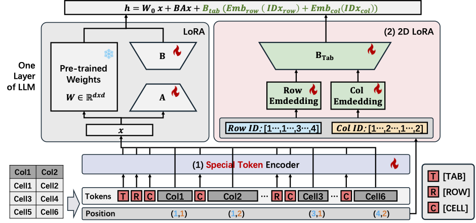

# TableLoRA: Low-rank Adaptation on Table Structure Understanding for Large Language Models

<p align="center">
  <a href="https://arxiv.org/abs/2503.04396">
    
  </a>
</p>

<div align="center">
  
</div>

Tabular data are crucial in many fields and their understanding by large language models (LLMs) under high parameter efficiency paradigm is important. However, directly applying parameter-efficient fine-tuning (PEFT) techniques to tabular tasks presents significant challenges, particularly in terms of better table serialization and the representation of twodimensional structured information within a one-dimensional sequence. To address this, we propose TableLoRA, a module designed to improve LLMs’ understanding of table structure during PEFT. It incorporates special tokens for serializing tables with special token encoder and uses 2D LoRA to encode low-rank information on cell positions. Experiments on four tabular-related datasets demonstrate that TableLoRA consistently outperforms vanilla LoRA and surpasses various table encoding methods tested in control experiments. These findings reveal that TableLoRA, as a tablespecific LoRA, enhances the ability of LLMs to process tabular data effectively, especially in low-parameter settings, demonstrating its potential as a robust solution for handling tablerelated tasks.

## Quick Start

Our implementation builds upon the [Llama Factory](https://github.com/hiyouga/LLaMA-Factory/tree/main) framework with the following key modifications:

1. **Data Preprocessing**:  
  - Added special tokens to input data before training in Llama Factory.  
  - Use code from the [`table_preprocess`](table_preprocess/) directory.
    ```shell
    python table_preprocess.py --dataset_name <dataset_name> --prompt_tuning True
    ```

2. **Table LoRA Data Processing**:  
  - Modified table_lora processing to recognize special tokens and include `position_id` as model input.   
  - Replace corresponding functions in `src/llamafactory/data/` with our implementations in the [`data`](data/) folder.

3. **Table LoRA Integration**:  
  - Extended PEFT to support table LoRA.
  - Add code from our [`table_lora`](table_lora/) directory to `src/llamafactory/`. 
  - Initialize with this code at entry points:  
    ```python
    from table_lora.table_lora import load_table_lora 
    load_table_lora()
    ```

After implementing these changes, you can train table LoRA using the modified Llama Factory framework.

## Citation
If you find this repository useful, please considering giving ⭐ or citing:
```
@inproceedings{he2025tablelora,
    title = "{T}able{L}o{RA}: Low-rank Adaptation on Table Structure Understanding for Large Language Models",
    author = "He, Xinyi  and
      Liu, Yihao  and
      Zhou, Mengyu  and
      He, Yeye  and
      Dong, Haoyu  and
      Han, Shi  and
      Yuan, Zejian  and
      Zhang, Dongmei",
    editor = "Che, Wanxiang  and
      Nabende, Joyce  and
      Shutova, Ekaterina  and
      Pilehvar, Mohammad Taher",
    booktitle = "Proceedings of the 63rd Annual Meeting of the Association for Computational Linguistics (Volume 1: Long Papers)",
    month = jul,
    year = "2025",
    address = "Vienna, Austria",
    publisher = "Association for Computational Linguistics",
    url = "https://aclanthology.org/2025.acl-long.1090/",
    pages = "22376--22391",
    ISBN = "979-8-89176-251-0",
}
```

## Contributing

This project welcomes contributions and suggestions.  Most contributions require you to agree to a
Contributor License Agreement (CLA) declaring that you have the right to, and actually do, grant us
the rights to use your contribution. For details, visit https://cla.opensource.microsoft.com.

When you submit a pull request, a CLA bot will automatically determine whether you need to provide
a CLA and decorate the PR appropriately (e.g., status check, comment). Simply follow the instructions
provided by the bot. You will only need to do this once across all repos using our CLA.

This project has adopted the [Microsoft Open Source Code of Conduct](https://opensource.microsoft.com/codeofconduct/).
For more information see the [Code of Conduct FAQ](https://opensource.microsoft.com/codeofconduct/faq/) or
contact [opencode@microsoft.com](mailto:opencode@microsoft.com) with any additional questions or comments.

## Trademarks

This project may contain trademarks or logos for projects, products, or services. Authorized use of Microsoft 
trademarks or logos is subject to and must follow 
[Microsoft's Trademark & Brand Guidelines](https://www.microsoft.com/en-us/legal/intellectualproperty/trademarks/usage/general).
Use of Microsoft trademarks or logos in modified versions of this project must not cause confusion or imply Microsoft sponsorship.
Any use of third-party trademarks or logos are subject to those third-party's policies.